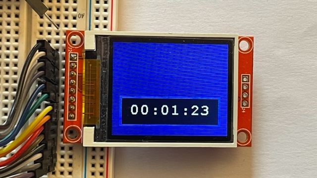

_**Piu' sotto, al termine della lingua inglese trovi il testo in italiano. </i>**_
_**Below English text you'll find the Italian version</i>**_

<br>


## So...

Now that you have created a new CubeIDE project as per these instructions:

- ["How to" create a CubeIDE project for this library](../1-HOWTO)

Now that you have chosen the backlight handling mode and set it as per these instructions:

- ["How to" handle display backlight](../2-BACKLIGHT)


You finally can setup the last program parameters and run it!<br>
Follow the below instructions if you like directly handling the display through the graphics functions in the library.
Otherwise, if you want to use the STM TouchGFX package, do not proceed here and go to [(TouchGFX) "How to" add this library to the created project](../3A-TOUCHGFX)


##### Parameters setup
Your project is almost ready. You must "tune" the software parameters into "z_displ_ST7735.h":
- section 0 - TouchGFX parameter: ok, if you are here reading, it means you have to add a comment to parameter in section 0, disabling TouchGFX handling
- section 1 - Port Parameters: here you have to set two macro constant with the SPI port name connecting display
- section 2 - SPI communication mode: uncomment the macro definition related to enabled communication mode (Polling mode, Interrupt mode or DMA mode). You must uncomment no less and no more than ONE definition here
- section 3 - Backlight Mode: see [BACKLIGHT page](../2-BACKLIGHT)  
- section 4 - Buffer size: define the "Buffer Level" you like (assign a value between 10 and 16 included) see [youtube video](https://youtu.be/oWx1-WmTwag) for information and analysis.  
- section 5 - Display size: despite the ST7735 SPI driver can handle displays of any size and color modes, this library was tested only on a 128x160 display running in RBG565.  


##### main.c setup

in main.c you now need to initialize display before entering in the main loop, this way:<br>
<br>
  (main.c)
  ```sh
  ...
  /* USER CODE BEGIN 2 */			// "USER CODE BEGIN 2" is after all system initializations and before entering the main loop. Good place to initialize display
  Displ_Init(Displ_Orientat_0);		// initialize the display and set the initial display orientation (here is orientaton: 0°) - THIS FUNCTION MUST PRECEED ANY OTHER DISPLAY FUNCTION CALL.  
  Displ_CLS(BLACK);			// after initialization (above) and before turning on backlight (below), you can draw the initial display appearance. (here I'm just clearing display with a black background)
  Displ_BackLight('I');  			// initialize backlight and turn it on at init level
  /* USER CODE END 2 */
  ...
  ```

##### running test functions

There is a test function you can run copying the "_test" files into the project.<br>
You can use it to:<br>
-	check the correct system installation and configuration<br>
-	learn how to use the library functions<br>
Test function is: <i><b>Displ_PerfTest()</b></i><br>
and you can use it this way:<br>

  ```sh
  ...
  /* Infinite loop */
  /* USER CODE BEGIN WHILE */
  while (1) 			// into the main loop you can add the test functions
  {
	  Displ_PerfTest();		// shows display graphics and performance
  ...
  ```


##### using library functions in your projects

passing the test, the display and the library is fully integrated in your system.<br>
Now you can use the library as per your needs:<br>
With a short look to the <i><b>Displ_PerfTest()</b></i> function you should find all the graphics functions you need.<br> 
A short description available for every function in the source file should help usage while developing.<br>
There is not much more to say.<br>
<br>
<br>

---

## Dunque...
Ora che hai creato un nuovo progetto con CubeIDE project seguendo queste istruzioni:

- [Guida per configurare un progetto con CubeIDE](./1-HOWTO)

Ora che hai scelto la gestione della retroilluminazione, seguendo queste istruzioni:

- [Guida alla gestione della retroilluminazione](./2-BACKLIGHT)

Puoi finalmente configurare gli ultimi parametri ed eseguire il programma!
Segui le istruzioni sotto se vuoi gestire direttamente il display attraverso le funzioni grafiche della libreria.<br>
Se invece vuoi usare il pacchetto STM TouchGFX, non procedere qui e passa a [(TouchGFX) Guida per aggiungere la libreria al progetto creato](./2A-TOUCHGFX)


##### Configurazione Parametri
Il progetto è quasi pronto. Devi mettere a punti i parametri nel file "z_displ_ST7735.h":
- sezione 0 - TouchGFX: se stai leggendo qui devi commentare la macro nella sezione 0, disabilitando la gestione TouchGFX  
- sezione 1 - Port Parameters: qui devi impostare due costanti macro con il nome della porta SPI a cui è connesso il display
- section 2 - SPI communication mode: togli il commento alla definizione definition relativa al tipo di comunicazione attivato (Polling moode, Interrupt mode o DMA mode). Devi togliere il commento ad una riga (NON di più e NON di meno) 
- section 3 - Backlight Mode: vedi la [pagina BACKLIGHT](../2-BACKLIGHT)  
- section 4 - Dimensione del Buffer: imposta il "Buffer Level" che preferisci (assegna un valore tra 10 e 16 inclusi) vedi [il video youtube]([../BACKLIGHT](https://youtu.be/oWx1-WmTwag) per informazioni ed analisi.
- section 5 - Dimensione Display: anche se il driver SPI ST7735 può gestire display di dimensioni diverse, questa libreria è stata testata solo su un display di 128x160 pixel in modalità RBG565.  


##### impostazione di main.c 

in main.c ora devi inizializzare il display prima di entrare nel main loop, in questo modo:

  (main.c)
  ```sh
  ...
  /* USER CODE BEGIN 2 */			// "USER CODE BEGIN 2" viene dopo tutte le inizializzazioni del sistema e prima del main loop
  Displ_Init(Displ_Orientat_0);		// inizializza il display ed imposta l'orientamento iniziale - QUESTA FUNZIONE DEVE PRECEDERE OGNI ALTRA FUNZIONE DELLA LIBRERIA
  Displ_CLS(BLACK);				// dopo l'inizializzazione (sopra) e prima di accendere la retroilluminazione (sotto), puoi impostare la schermata iniziale. (qui semplicemente cancello lo schermo con uno sfondo nero) 
  Displ_BackLight('I');  			// inizializza la retroilluminazione e la accende al livello init 
  /* USER CODE END 2 */
  ...
  ```

##### eseguire le funzioni di test

C'e' una funzione di test disponibile installando i "_test" file.<br>
Puoi usarla per:<br>
-	verificare la corretta installazione e configurazione del sistema<br>
-	imparare come usare le funzioni della libreria<br>
La funzione é <i><b>Displ_PerfTest()</b></i> e puoi usarla in questo modo:
  ```sh
  ...
  /* Infinite loop */
  /* USER CODE BEGIN WHILE */
  while (1) 			// nel main loop puoi aggiungere le funzioni di test
  {
	// display testing
	Displ_PerfTest();		// mostra la grafica e le performance del display
  ...
  ```

##### usare la libreria nei tuoi progetti

Superando il test hai la prova che il display e la libreria sono pienamente integrati nel progetto.<br>
Ora puoi usare la libreria secondo le necessità: con una occhiata alla funzione <i><b>Displ_PerfTest()</b></i> dovresti individuare tutte le funzioni grafiche che ti occorrono.<br> 
Una breve descrizione disponibile, per ogni funzione, nel file sorgente dovrebbe aiutare durante lo sviluppo.<br>
Non c'è molto altro da dire.<br>
